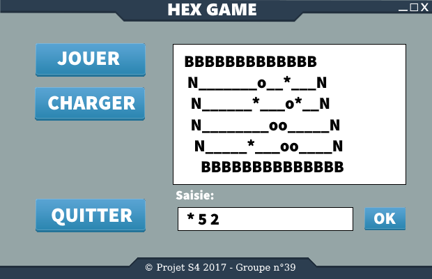

HexGame
=======

Description:
------------

Le projet HexGame est un projet universitaire qui s’inscrit dans le cadre du
module projet S4 de la seconde année de licence à l’Université Paul Sabatier,
Toulouse III.

Le principe du projet est de réaliser en groupe une implémentation numérique du
jeu société (jeu de hex).

Screenshot de l’evolution:
--------------------------

Prototype graphique - version 1

Développeurs:
-------------

-   **Mathieu P**

-   **Thomas L**

-   **Rémi M**

Liens:
------
[GITHUB](https://github.com/Erim32)
[WEB](https://erim.fr/hex)

Licence:
--------

**GPL v3**
